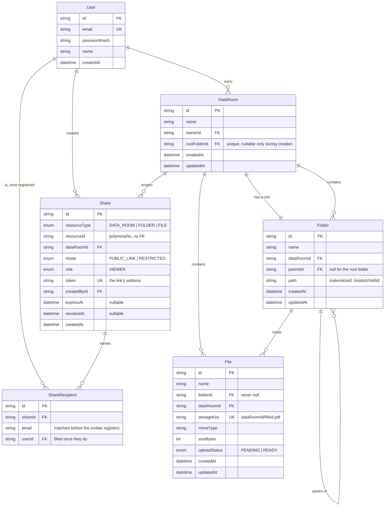

# Data model

## The four decisions this diagram encodes

**Every data room owns a root folder.** `File.folderId` is therefore never
null, which is what makes `@@unique([folderId, name])` actually enforce unique
names at the top level too — Postgres treats NULLs as distinct, so a nullable
`folderId` would have silently allowed duplicates there. `DataRoom.rootFolderId`
is nullable only because the folder cannot exist before the row it points at;
both are written in one transaction.

**`Folder.path` is a materialized path** of the form `/rootId/childId/`, indexed
as `(dataRoomId, path)`. "Everything under this folder" is a single indexed
prefix query rather than a recursive walk, and it is what makes the delete
preview, the subtree delete and the inherited-share check each one query. The
bounding slashes are load-bearing: without the trailing one, `/root/legal`
matches `/root/legalese/` and a prefix query leaks a sibling subtree.

**`Share` is deliberately polymorphic.** `resourceType` + `resourceId` with no
foreign key, because the target may be a data room, a folder or a file.
Cascade cleanup rides on `dataRoomId` instead, and `AccessService` is the only
thing that resolves the pair.

**`Share.role` is an enum holding only `VIEWER`.** Adding `EDITOR` is one enum
value plus write-permission policy — and because the granted role is read off
the share rather than hard-coded, the compiler stops at the one place that has
to decide what an editor may do.

## Indexes

| Index | Serves |
| --- | --- |
| `Folder(dataRoomId, path)` | subtree queries, inherited shares, delete preview |
| `Folder(parentId, name)` unique | duplicate folder names in one parent |
| `File(folderId, name)` unique | duplicate file names in one folder |
| `File(folderId, createdAt, id)` | keyset pagination of a listing |
| `File(dataRoomId)` | subtree aggregates |
| `Share(token)` unique | resolving a link |
| `Share(dataRoomId)`, `Share(resourceType, resourceId)` | access resolution, listing a resource's shares |
